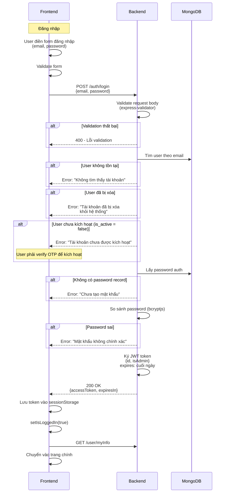
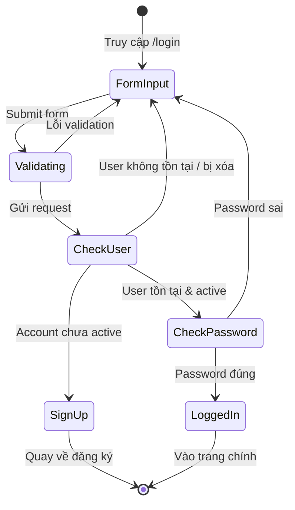

# Luồng Đăng Nhập (Login Flow)

## 1. Tổng quan

Luồng đăng nhập gồm **1 bước**:
- User nhập email + password → `POST /auth/login` → Trả về JWT token

---

## 2. Sơ đồ luồng (Sequence Diagram)



---

## 3. Sơ đồ trạng thái



---

## 4. Chi tiết API

### POST /auth/login

**Request Body:**

| Field    | Type   | Required | Validation          |
|----------|--------|----------|---------------------|
| email    | string | ✅        | Không rỗng, email   |
| password | string | ✅        | Không rỗng          |

**Response:** `{ responseData: { accessToken: "jwt...", expiresIn: 12345 } }`

---

## 5. Quy tắc nghiệp vụ

| # | Quy tắc                                                      |
|---|---------------------------------------------------------------|
| 1 | Only active users can login (`is_active=true`)               |
| 2 | Deleted accounts cannot login (`is_deleted=false`)          |
| 3 | Password must match exactly (bcryptjs compare)               |
| 4 | JWT payload: `{ id, isAdmin }`, expires end of day           |
| 5 | Token stored in `sessionStorage` on client                  |

---

## 6. Error Handling

| Scenario | Code | Message | Action |
|----------|------|---------|--------|
| Email not found | 400 | "Không tìm thấy tài khoản" | Show error toast |
| Account deleted | 400 | "Tài khoản đã bị xóa khỏi hệ thống" | Contact admin |
| **Account not activated** | **400** | **"Tài khoản chưa được kích hoạt"** | **Redirect to /sign-up with email pre-filled** |
| Password wrong | 400 | "Mật khẩu không chính xác" | Show error, allow retry |
| No password auth | 500 | "Chưa tạo mật khẩu" | System error |

---

## 7. Workflow: Not Activated Account

### Scenario: User đã register nhưng chưa verify OTP

**Timeline:**
```
1. User register @ 10:00 AM → is_active=false
2. User cố login @ 10:05 AM
3. ❌ Login fail: "Tài khoản chưa được kích hoạt"
4. User quay về /sign-up, nhập lại email + password
5. System detect email chưa active → re-register flow
6. OTP gửi lại → User verify → is_active=true
7. User login thành công ✅
```

### Implementation Flow:

```
POST /auth/login
  ├─ Validate email/password format
  ├─ Find user by email
  ├─ Check user exists
  ├─ Check is_deleted (❌ reject)
  ├─ Check is_active ← ⚠️ THIS IS THE KEY CHECK
  │  └─ If false → Error: "Tài khoản chưa được kích hoạt"
  │               → Frontend should offer:
  │                   - "Register again?" → /sign-up
  │                   - "Resend OTP?" → direct to OTP form
  ├─ Get password auth
  ├─ Verify password
  ├─ Sign JWT token
  └─ Return token
```

---

## 8. Frontend Recommendations

### When Login Fails with "Not Activated"

**Option 1: Auto-redirect to Sign-up**
```typescript
if (error.message.includes("chưa được kích hoạt")) {
  // Pre-fill email, go to sign-up page
  navigate("/sign-up", { state: { email: loginEmail } })
}
```

**Option 2: Show Two Actions**
```
⚠️ Tài khoản chưa được kích hoạt

[Đăng ký lại]  [Gửi lại OTP]
```

**Option 3: Direct to OTP Verification**
```typescript
if (error.includes("chưa được kích hoạt")) {
  // Go directly to OTP form, no re-registration needed
  navigate("/verify-otp", { state: { email: loginEmail } })
  // User clicks "Resend OTP" to get new code
}
```

---

## 9. Test Cases

### 9.1 POST /auth/login - Happy Path

| TC   | Mô tả                  | Input              | Expected                    |
|------|------------------------|--------------------|-----------------------------|
| TC01 | Login thành công       | Email & password hợp lệ, account active | 200 OK, `{ accessToken, expiresIn }` |
| TC02 | JWT token hợp lệ      | Login OK           | Token decode: `{ id, isAdmin }` |
| TC03 | JWT expires cuối ngày  | Login OK @ 10:00 AM | Token expires ~14 hours later |

### 9.2 Validation Errors

| TC   | Mô tả             | Input          | Expected                      |
|------|-------------------|----------------|-------------------------------|
| TC04 | Email rỗng        | `email: ""`    | 400 - "Email không được để trống" |
| TC05 | Email sai format  | `email: "abc"` | 400 - "Email không hợp lệ"   |
| TC06 | Password rỗng     | `password: ""` | 400 - "Mật khẩu không được để trống" |

### 9.3 Business Logic Errors

| TC   | Mô tả                    | Input                           | Expected             |
|------|--------------------------|-------|----------------------|
| TC07 | **Account not activated**    | **Account chưa verify OTP, password đúng** | **Error: "Tài khoản chưa được kích hoạt"** |
| TC08 | Account bị xóa          | Account `is_deleted=true`       | Error: "Tài khoản đã bị xóa..." |
| TC09 | Email không tồn tại    | Non-existent email              | Error: "Không tìm thấy tài khoản" |
| TC10 | Password sai            | Correct email, wrong password   | Error: "Mật khẩu không chính xác" |

---

## 10. Related Flows

- **Registration**: [REGISTRATION_FLOW.md](./REGISTRATION_FLOW.md) - How user registers and gets activated
- **OTP Verification**: Part of registration flow
- **Re-registration**: If user registered but didn't verify → can register again with same email

---

## 11. Recovery Options

If user is stuck with unactivated account:

| User Action | System Response |
|-------------|-----------------|
| Click "Sign up again" with registered email | Offer to resend OTP or re-register |
| Direct link to /verify-otp?email=xxx | Show OTP form + "Resend OTP" button |
| Support tickets | Admin can manually activate account |
