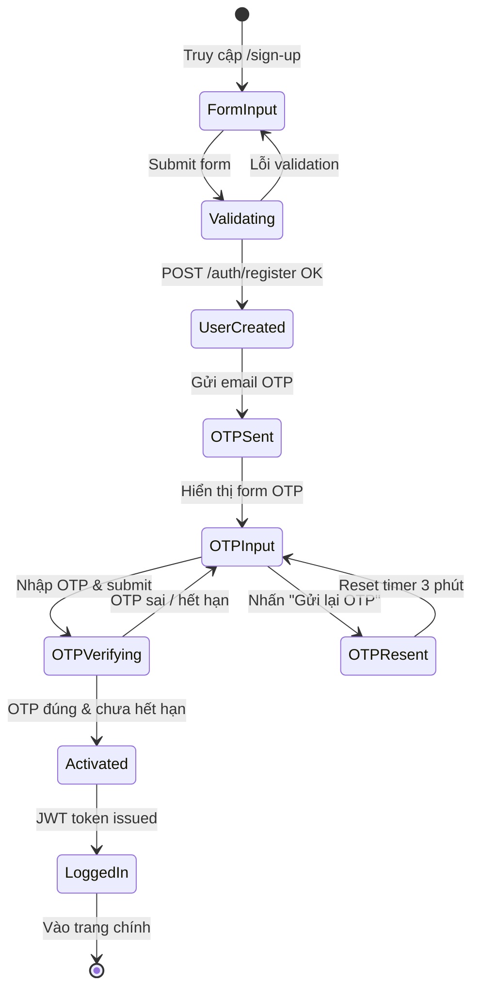

# Luồng Đăng Ký (Registration Flow)

## 1. Tổng quan

Luồng đăng ký gồm **3 bước chính**:

1. User điền form đăng ký → `POST /auth/register`
2. User nhập OTP từ email → `POST /auth/otp/verify`
3. (Tuỳ chọn) Gửi lại OTP → `POST /auth/otp/resend`

---

## 2. Sơ đồ luồng (Sequence Diagram)

```mermaid
sequenceDiagram
    participant FE as Frontend
    participant BE as Backend
    participant DB as MongoDB
    participant Mail as Mail Service

    Note over FE: Bước 1 - Đăng ký
    FE->>FE: User điền form đăng ký<br/>(họ tên, email, SĐT,<br/>quận/phường, mật khẩu)
    FE->>FE: Validate form (Zod schema)
    FE->>BE: POST /auth/register<br/>{last_name, middle_name, first_name,<br/>email, phone, unit, password}

    BE->>BE: Validate request body<br/>(express-validator)

    alt Validation thất bại
        BE-->>FE: 400 - Lỗi validation
    end

    BE->>DB: Tìm user theo email HOẶC phone

    alt Email đã bị xóa (is_deleted = true)
        BE-->>FE: Error: "Tài khoản này đã bị xóa<br/>khỏi hệ thống"
    end

    alt Email đã tồn tại & active
        BE-->>FE: Error: "Email này đã được<br/>đăng ký trước đó"
    end

    alt SĐT đã tồn tại
        BE-->>FE: Error: "Số điện thoại đã được<br/>đăng ký trước đó"
    end

    alt Email chưa kích hoạt (is_active = false)
        Note over BE: Re-register: cập nhật thông tin,<br/>tạo OTP mới, gửi lại email
        BE->>DB: Kiểm tra SĐT mới không bị trùng user khác
        BE->>DB: Cập nhật thông tin user
        BE->>DB: Cập nhật/tạo password auth
        BE->>DB: Cập nhật/tạo OTP auth mới
        BE->>Mail: Gửi email OTP
        BE-->>FE: 200 OK (như đăng ký mới)
    end

    BE->>DB: Tạo User (is_active=false, is_deleted=false)
    Note over DB: Pre-save hook: Viết hoa<br/>chữ cái đầu họ, tên, tên đệm

    BE->>BE: Sinh OTP 6 chữ số
    BE->>DB: Tạo UserAuth [PASSWORD]<br/>(hash bcryptjs)
    BE->>DB: Tạo UserAuth [OTP]<br/>(hash bcryptjs)

    BE->>Mail: Gửi email OTP
    Mail-->>FE: Email chứa mã OTP

    BE-->>FE: 200 OK<br/>(dev: trả OTP, prod: trả message)

    Note over FE: Bước 2 - Xác minh OTP
    FE->>FE: Hiển thị form OTP<br/>Bắt đầu đếm ngược 3 phút
    FE->>FE: User nhập 6 chữ số OTP
    FE->>BE: POST /auth/otp/verify<br/>{email, otp}

    BE->>BE: Validate email & OTP format
    BE->>DB: Tìm user theo email

    alt User không tồn tại
        BE-->>FE: Error: "Không tìm thấy tài khoản"
    end

    alt User đã bị xóa
        BE-->>FE: Error: "Tài khoản đã bị xóa<br/>khỏi hệ thống"
    end

    BE->>DB: Lấy UserAuth [OTP]

    alt Không có OTP record
        BE-->>FE: Error: "Chưa tạo mã xác minh"
    end

    BE->>BE: So sánh OTP (bcryptjs)

    alt OTP sai
        BE-->>FE: Error: "Mã xác minh không chính xác"
    end

    BE->>BE: Kiểm tra thời gian hết hạn<br/>(> 3 phút từ updated_at)

    alt OTP hết hạn
        BE-->>FE: Error: "Mã xác minh đã hết hạn"
    end

    BE->>DB: Xoá OTP record
    BE->>DB: Cập nhật user: is_active = true
    BE->>BE: Ký JWT token<br/>{id, isAdmin}<br/>expires: cuối ngày

    BE-->>FE: 200 OK<br/>{accessToken, expiresIn}

    FE->>FE: Lưu token vào sessionStorage
    FE->>FE: setIsLoggedIn(true)
    FE->>BE: GET /user/myInfo
    FE->>FE: Chuyển vào trang chính

    Note over FE: (Tuỳ chọn) Gửi lại OTP
    FE->>BE: POST /auth/otp/resend<br/>{email}

    BE->>DB: Tìm user theo email
    BE->>BE: Validate user<br/>(cho phép is_active=false)
    BE->>BE: Sinh OTP 6 chữ số mới

    alt Có OTP record cũ
        BE->>DB: Cập nhật OTP cũ
    else Không có OTP record
        BE->>DB: Tạo OTP mới
    end

    BE->>Mail: Gửi email OTP mới
    BE-->>FE: 200 OK
    FE->>FE: Reset đếm ngược 3 phút
```

---

## 3. Sơ đồ trạng thái User

---

## 4. Chi tiết API

### 4.1 POST /auth/register

**Request Body:**

| Field        | Type   | Required | Validation                            |
| ------------ | ------ | -------- | ------------------------------------- |
| first_name   | string | ✅        | Không rỗng, chữ cái vi-VN            |
| middle_name  | string | ❌        | Chữ cái + khoảng trắng               |
| last_name    | string | ✅        | Không rỗng, chữ cái vi-VN            |
| email        | string | ✅        | Không rỗng, format email              |
| phone        | string | ✅        | Không rỗng, SĐT VN hợp lệ           |
| unit.district| string | ✅        | Không rỗng                            |
| unit.ward    | string | ✅        | Không rỗng                            |
| password     | string | ✅        | Không rỗng, ≥ 8 ký tự, không khoảng trắng |

**Response (dev):** `{ responseData: { otp: "123456" } }`
**Response (prod):** `{ responseData: { message: "Đăng ký tài khoản thành công" } }`

### 4.2 POST /auth/otp/verify

**Request Body:**

| Field | Type   | Required | Validation                |
| ----- | ------ | -------- | ------------------------- |
| email | string | ✅        | Không rỗng, format email  |
| otp   | string | ✅        | Không rỗng, 6 chữ số     |

**Response:** `{ responseData: { accessToken: "jwt...", expiresIn: 12345 } }`

### 4.3 POST /auth/otp/resend

**Request Body:**

| Field | Type   | Required | Validation               |
| ----- | ------ | -------- | ------------------------ |
| email | string | ✅        | Không rỗng, format email |

**Response (dev):** `{ responseData: { otp: "654321" } }`
**Response (prod):** `{ responseData: { message: "Gửi mã xác minh thành công" } }`

---

## 5. Quy tắc nghiệp vụ

| # | Quy tắc                                                      |
|---|---------------------------------------------------------------|
| 1 | Email & SĐT phải duy nhất trong hệ thống                    |
| 2 | User mới tạo có `is_active=false`, `is_deleted=false`        |
| 3 | Password hash bằng bcryptjs trước khi lưu DB                |
| 4 | OTP gồm 6 chữ số, hash bằng bcryptjs                        |
| 5 | OTP hết hạn sau 3 phút (tính từ `updated_at`)               |
| 6 | Sau khi verify OTP thành công → xoá OTP record, set `is_active=true` |
| 7 | JWT payload: `{ id, isAdmin }`, hết hạn cuối ngày           |
| 8 | Tên được viết hoa chữ cái đầu trước khi lưu (pre-save hook)|
| 9 | Token lưu vào `sessionStorage` phía client                  |
| 10| Nếu email đã đăng ký nhưng chưa active → cho phép đăng ký lại (cập nhật thông tin + OTP mới) |

---

## 6. Frontend Flow

| Bước | Component                     | Mô tả                                            |
| ---- | ----------------------------- | ------------------------------------------------- |
| 1    | `SignUpForm`                  | Form nhập thông tin + mật khẩu                    |
| 2    | `OtpVerificationForm`        | Form nhập OTP 6 chữ số + đếm ngược               |

**Frontend Validation (Zod):**

- `lastAndMiddleName`: Unicode letters, không số/ký tự đặc biệt
- `firstName`: Unicode letters
- `email`: Format email, lowercase
- `phone`: Đúng 10 chữ số
- `district`, `ward`: Bắt buộc chọn
- `password.default`: ≥ 8 ký tự, không khoảng trắng
- `password.confirm`: Phải trùng với `password.default`
- `otp`: Đủ 6 ký tự

---

## 7. Important Notes

⚠️ **If user doesn't verify OTP and tries to login:**
- Login will **FAIL** with error: "Tài khoản chưa được kích hoạt"
- User must verify OTP through `/auth/otp/verify` to activate account
- See [LOGIN_FLOW.md](./LOGIN_FLOW.md) for details on login behavior with inactive accounts

---

## 8. Test Cases

### 8.1 POST /auth/register - Happy Path

| TC   | Mô tả                           | Input                                                                 | Expected                                |
| ---- | -------------------------------- | --------------------------------------------------------------------- | --------------------------------------- |
| TC01 | Đăng ký thành công               | Tất cả fields hợp lệ, email & SĐT chưa tồn tại                     | 200 OK, tạo user + password + OTP, gửi email |
| TC02 | Trả OTP trong môi trường dev    | Đăng ký hợp lệ, NODE_ENV=development                                 | Response chứa `{ otp: "..." }`          |
| TC03 | Không trả OTP trong prod        | Đăng ký hợp lệ, NODE_ENV=production                                  | Response chứa `{ message: "..." }`      |

### 8.2 POST /auth/register - Validation Errors

| TC   | Mô tả                                | Input                        | Expected                                      |
| ---- | ------------------------------------- | ---------------------------- | --------------------------------------------- |
| TC04 | Email rỗng                           | `email: ""`                  | 400 - "Email không được để trống"             |
| TC05 | Email sai format                     | `email: "abc"`               | 400 - "Email không hợp lệ"                   |
| TC06 | Tên rỗng                            | `first_name: ""`             | 400 - "Tên không được để trống"               |
| TC07 | Tên chứa số                         | `first_name: "An1"`          | 400 - "Tên không hợp lệ"                     |
| TC08 | Họ rỗng                             | `last_name: ""`              | 400 - "Họ không được để trống"                |
| TC09 | SĐT rỗng                            | `phone: ""`                  | 400 - "Số điện thoại không được để trống"     |
| TC10 | SĐT sai format                      | `phone: "123"`               | 400 - "Số điện thoại không hợp lệ"           |
| TC11 | Mật khẩu rỗng                       | `password: ""`               | 400 - "Mật khẩu không được để trống"          |
| TC12 | Mật khẩu < 8 ký tự                  | `password: "abc"`            | 400 - "Mật khẩu cần ít nhất 8 ký tự"         |
| TC13 | Mật khẩu có khoảng trắng            | `password: "abc 12345"`      | 400 - "Mật khẩu không thể chứa khoảng trắng" |
| TC14 | Quận rỗng                           | `unit.district: ""`          | 400 - "Quận không được để trống"              |
| TC15 | Phường rỗng                         | `unit.ward: ""`              | 400 - "Phường/ xã không được để trống"        |

### 8.3 POST /auth/register - Business Logic Errors

| TC   | Mô tả                                  | Input                                          | Expected                                                          |
| ---- | --------------------------------------- | ---------------------------------------------- | ----------------------------------------------------------------- |
| TC16 | Email đã tồn tại & active             | Email đã đăng ký, `is_active=true`              | Error: "Email này đã được đăng ký trước đó"                      |
| TC17 | Email đã tồn tại & inactive (re-register) | Email đã đăng ký, `is_active=false`          | 200 OK, cập nhật thông tin user + password + OTP mới, gửi email   |
| TC18 | Email đã bị xoá                       | Email đã đăng ký, `is_deleted=true`             | Error: "Tài khoản này đã bị xóa khỏi hệ thống..."               |
| TC19 | SĐT đã tồn tại                        | Phone đã đăng ký bởi user khác                  | Error: "Số điện thoại đã được đăng ký trước đó"                  |

### 8.4 POST /auth/otp/verify - Happy Path

| TC   | Mô tả                               | Input                                | Expected                                     |
| ---- | ------------------------------------ | ------------------------------------ | -------------------------------------------- |
| TC20 | Xác minh OTP thành công             | Email đã đăng ký, OTP đúng, < 3 phút | 200 OK, `{ accessToken, expiresIn }`         |
| TC21 | User được kích hoạt sau verify      | OTP đúng                             | User `is_active = true`                      |
| TC22 | OTP record bị xoá sau verify        | OTP đúng                             | UserAuth [OTP] đã bị xoá                    |
| TC23 | JWT chứa đúng payload               | OTP đúng                             | Token decode: `{ id, isAdmin }`              |

### 8.5 POST /auth/otp/verify - Error Cases

| TC   | Mô tả                               | Input                              | Expected                                    |
| ---- | ------------------------------------ | ---------------------------------- | ------------------------------------------- |
| TC24 | Email không tồn tại                 | `email: "notexist@test.com"`       | Error: "Không tìm thấy tài khoản"          |
| TC25 | OTP sai                             | `otp: "000000"` (sai mã)           | Error: "Mã xác minh không chính xác"       |
| TC26 | OTP hết hạn (> 3 phút)             | OTP đúng nhưng quá 3 phút          | Error: "Mã xác minh đã hết hạn"            |
| TC27 | Không có OTP record                 | User chưa có OTP auth              | Error: "Chưa tạo mã xác minh"              |
| TC28 | User đã bị xoá                      | User `is_deleted=true`             | Error: "Tài khoản đã bị xóa khỏi hệ thống"|
| TC29 | OTP format sai                      | `otp: "abc"`                       | 400 - "OTP phải bao gồm 6 chữ số"          |
| TC30 | OTP rỗng                           | `otp: ""`                          | 400 - "OTP không được để trống"             |

### 8.6 POST /auth/otp/resend

| TC   | Mô tả                                   | Input                           | Expected                                   |
| ---- | ---------------------------------------- | ------------------------------- | ------------------------------------------ |
| TC31 | Gửi lại OTP thành công (có record cũ)   | Email hợp lệ, có OTP cũ         | 200 OK, cập nhật OTP, gửi email mới       |
| TC32 | Gửi lại OTP thành công (không có record) | Email hợp lệ, chưa có OTP       | 200 OK, tạo OTP mới, gửi email            |
| TC33 | Email không tồn tại                      | `email: "noone@test.com"`        | Error: "Không tìm thấy tài khoản"         |
| TC34 | User đã bị xoá                          | User `is_deleted=true`           | Error: "Tài khoản đã bị xóa khỏi hệ thống"|
| TC35 | Email rỗng                              | `email: ""`                      | 400 - "Email không được để trống"          |

### 8.7 Frontend - Form Validation

| TC   | Mô tả                                 | Hành vi                                  | Expected                                         |
| ---- | -------------------------------------- | ---------------------------------------- | ------------------------------------------------ |
| TC36 | Họ tên đệm chứa số                   | Nhập "Nguyễn 123"                        | Lỗi: "Họ và tên đệm không được có số hoặc kí tự đặc biệt" |
| TC37 | SĐT không đủ 10 số                    | Nhập "09123"                             | Lỗi: "Số điện thoại phải có 10 kí tự"           |
| TC38 | SĐT chứa chữ                         | Nhập "098765abc1"                        | Lỗi: "Số điện thoại không bao gồm chữ cái..."   |
| TC39 | Mật khẩu xác nhận không khớp          | default: "12345678", confirm: "87654321" | Lỗi: "Mật khẩu không trùng khớp"                |
| TC40 | Không chọn quận                       | Bỏ trống district                        | Lỗi: "Vui lòng chọn thông tin"                  |
| TC41 | Không chọn phường                     | Bỏ trống ward                            | Lỗi: "Vui lòng chọn thông tin"                  |
| TC42 | OTP chưa nhập đủ 6 số                | Nhập "123"                               | Lỗi: "Vui lòng nhập đầy đủ mã xác nhận"        |

### 8.8 Frontend - UX Flow

| TC   | Mô tả                                    | Hành vi                                   | Expected                                        |
| ---- | ----------------------------------------- | ----------------------------------------- | ----------------------------------------------- |
| TC43 | Chuyển sang bước OTP sau đăng ký         | Submit form thành công                     | Hiển thị form OTP, bắt đầu đếm 3 phút          |
| TC44 | Nút gửi lại OTP disable khi đang đếm    | Timer > 0                                  | Nút "Gửi lại" bị disable                       |
| TC45 | Nút gửi lại OTP enable khi hết thời gian | Timer = 0                                  | Nút "Gửi lại" enable                           |
| TC46 | Nhấn "Quay lại" từ OTP form             | Click nút Back                             | Quay về form đăng ký (step 1)                   |
| TC47 | Auto-login sau verify OTP thành công     | OTP verify thành công                      | Token lưu sessionStorage, fetch user info, vào app |
| TC48 | Reset timer khi gửi lại OTP             | Click "Gửi lại"                            | Timer reset về 3 phút                           |
| TC49 | Toast thông báo thành công               | Đăng ký / verify OTP thành công            | Hiển thị toast success                          |
| TC50 | Toast thông báo lỗi                      | API trả lỗi                               | Hiển thị toast error với message từ server       |
